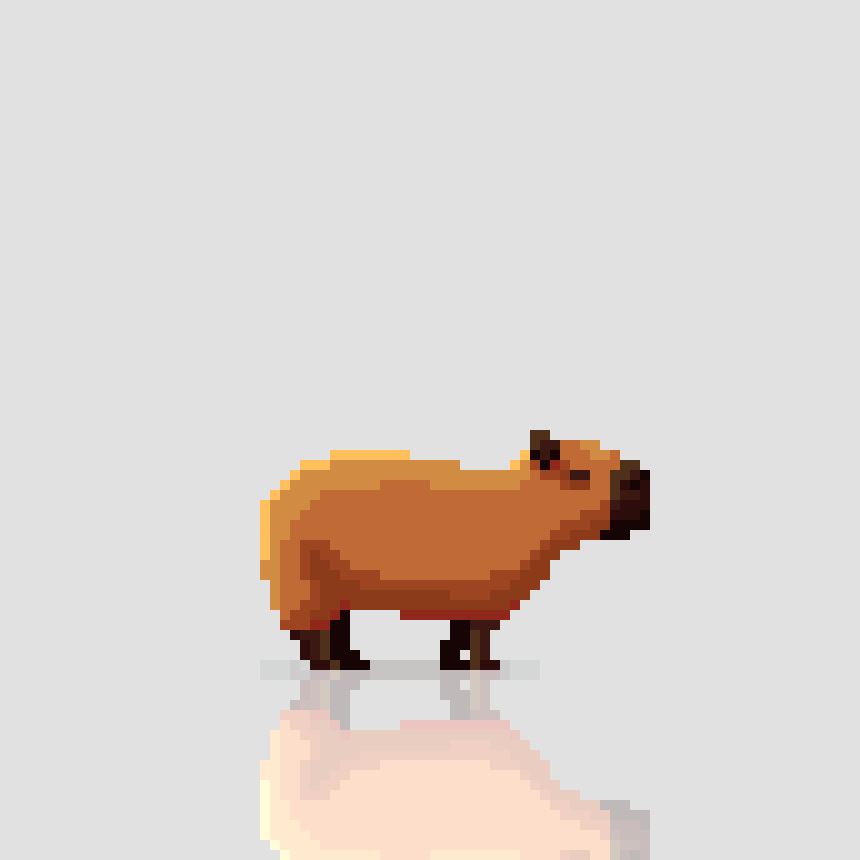

# Tytuł projketu

Opis projektu można dodać po prostu.
To nie będzie pod spodem. 

Ta linia będzie niżej.

To będzie **pogrubione**

To też będzie __pogrubione__

To będzie _pochylone_

-------------------------

Fajnie, nie?

-------------------------

Features naszej aplikacji
- tworzy wirtualne modele czegoś tam
- wylicza puszki farby

Skróty klawiszowe

`Alt + F4` Specjalna funkcja

`Ctrl + Alt + Del` Druga specjalna funkcja

Tak wysłać rakietę w kosmos:

    Rakieta rakieta = new Rakieta();
    rakieta.GoToCosmos();

A tak z cytatami:

> Proszę pana, mi nie działa

